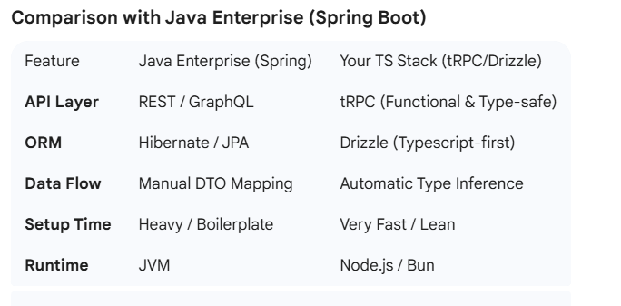
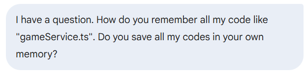

# Rock Paper Sissors Architecture

## To run the application
1. In VS Code, open a terminal and run "npm run dev:server"
2. Open another terminal, and run "npm run dev:client"
3. Open browser, run the link: http://localhost:5173/

## 🚀 Enterprise RPS: Full-Stack Architecture
This project demonstrates a professional-grade "Dual-Protocol" architecture. It combines the developer velocity of tRPC with the interoperability of a REST API (Hono), all backed by a type-safe Postgres layer.

## 🏗️ The Stack: Why this is "Best-in-Class"
This specific combination of tools is often called the "T3 Stack" philosophy. It is considered the gold standard for TypeScript development in 2026 for three reasons:

1. End-to-End Type Safety: A change in the database schema propagates all the way to the React UI. If a column name changes, the frontend won't compile.

2. Zero Overhead ORM: Unlike Hibernate (Java), Drizzle is "Headless." It provides IntelliSense for SQL without the heavy runtime performance cost.

3. The Single Source of Truth: Business logic lives in a shared Service Layer, used by both the internal React app (via tRPC) and external partners (via Hono).

## 🔄 Data & Control Flow
Here is how a single "Play" move travels through the system:

1. The Frontend (React + tRPC Client)
    * Action: User clicks "Rock."

    * Logic: The React component calculates the result locally for instant UI feedback, then triggers a tRPC Mutation.

    * Control: The tRPC Client creates a secure, type-safe JSON-RPC request to the server.

2. The Gateway (Hono + tRPC Server)
    * Action: Hono receives the request at /trpc/recordGame.

    * Logic: The tRPC Router intercepts it. It uses Zod to validate the payload. If the data isn't a valid "Move" (e.g., someone sent a string "Lizard"), it rejects the request immediately.

    * Security: This is where Authentication (Auth.js) will eventually sit to verify who is playing.

3. The Service Layer (Domain Logic)
    * Action: The router calls GameService.saveResult().

    * Logic: This is a pure TypeScript function. It doesn't care if the request came from tRPC, a REST API, or a Cron job.

    * Separation of Concerns: This keeps the "Business Logic" decoupled from the "Transport Logic."

4. The Persistence Layer (Drizzle + Postgres)
    * Action: Drizzle converts the TypeScript object into a SQL INSERT statement.

    * Database: Postgres receives the command. Because we used Custom Enums, Postgres performs a final check to ensure the data matches our move and result types.

    * Storage: The data is permanently written to the game_results table.

## 🛠️ Inter-Application Communication (REST)
For other applications (Java, Python, etc.) that need our data:

    * Endpoint: GET /api/history

    * Handler: Hono calls the same GameService.getRecentHistory() used by tRPC.

    * Result: Consistent data delivered via standard JSON, documented via OpenAPI/Swagger.

## 📁 Project Structure

## Comparison with Java Enterprise (Spring Boot)

## That is a fantastic, modern stack. In the industry, 

this combination (Postgres + Drizzle + tRPC + React) is often referred to as the "T3 Stack" or a variation of it. It is absolutely "enterprise-ready" and is currently one of the most productive ways to build TypeScript applications.

Since you are coming from a Java background, you will likely find this setup more enjoyable than traditional REST because it solves the "Data Contract" problem without the overhead of heavy XML or manual Swagger documentation.

Here is why this stack is perfect for an enterprise application:

1. The "End-to-End" Type Safety (tRPC)
This is the "killer feature." In Java, you often have to manually sync your Backend DTOs with your Frontend models.
How tRPC works: It allows you to import the Type definitions of your backend functions directly into your React frontend.
The Benefit: If you change a column name in your Postgres database or a property in your service, your React code will immediately show a compile-time error. You get "Autocomplete" across the entire network boundary.

2. Drizzle ORM (The Modern Hibernate)
If you've used Hibernate or JPA in Java, Drizzle will feel familiar but much lighter.
SQL-Like: Unlike other ORMs that hide SQL, Drizzle feels like writing SQL but with full TypeScript autocompletion.
Performance: It has zero overhead. It doesn't use heavy "classes" or "reflections" like Java ORMs; it just outputs clean queries.
Migrations: It handles database schema changes automatically, which is vital for enterprise version control.

3. PostgreSQL
There is no debate here—Postgres is the gold standard for enterprise data. It handles relational data, JSON (NoSQL-style), and massive scale perfectly.

## Why Auth.js is Better for You
Since you are using Postgres and Drizzle, Auth.js is incredibly powerful. They provide an Official Drizzle Adapter that automatically creates the necessary tables in your Postgres database (Users, Accounts, Sessions, and VerificationTokens).

How it fits into your "Service" layer:
With tRPC, you can create a "Protected Procedure." This is a piece of code that automatically checks if a user is logged in before allowing the service to run.

Auth.js handles the login/session.

tRPC context sees the session.

Your Service knows exactly which userId is calling it.

## The "Clean Architecture" Folder Structure
Since you'll be starting this tomorrow, here is how you should organize your folders to keep things clean and modular:

src/

    db/ -> Drizzle schema definitions and Postgres connection.

    services/ -> The Core. This is where your actual logic lives (e.g., gameService.ts). Both tRPC and Hono will call these.

    trpc/ -> Your tRPC router and context (for your React app).

    api/ -> Your Hono/Express routes (for external REST apps).

    features/ -> Your React components (like the game we built today).

## Why Hono over Express?
Since you're starting fresh in 2026, I strongly suggest Hono over Express:

TypeScript First: Hono is written in TypeScript and provides better type inference out of the box.

Speed: It is significantly faster than Express.

Validation: It has a built-in "Zod" validator that makes it easy to validate the JSON coming from external applications—ensuring your Postgres database stays clean.

## Why this is "Best-in-Class" Architecture
By setting it up this way, you've created a decoupled system:

Zod Validation: In the tRPC router, z.enum(...) ensures that even if a hacker tries to send a "LIZARD" move to your API, the server will reject it before it ever touches your database.

Code Reuse: Notice how both the Hono /api/history route and the tRPC getStats procedure call the exact same GameService.

Type Sharing: Your React app will import the AppRouter type, giving you full autocompletion for saveGame and getStats.

That is exactly right. In this architecture, tRPC acts as the "courier" that carries the moves from your React frontend to your server, and Drizzle is the "librarian" that writes those moves into your Postgres database.

Here is the flow of a single game round in your enterprise stack:

React: You click "ROCK."

tRPC Client: Sends a type-safe request: { userMove: 'ROCK', ... }.

tRPC Router: Validates the move using Zod.

Service Layer: Receives the validated data.

Drizzle: Executes the INSERT SQL statement.

Postgres: Stores the data using your custom move and result Types.

## Why so many packages?
It might look like a lot, but in an enterprise architecture, we split these up so the frontend and backend stay lightweight. Here is what each one does:

@trpc/server: The engine that handles your routers and procedures.

hono: The "web server" that listens for requests and passes them to tRPC.

zod: Your "Validator" (it ensures the data coming in is correct).

@trpc/react-query: This is the "magic" piece. It’s built on top of TanStack Query (the industry standard for data fetching). It handles:

Loading states (showing a spinner while the DB is working).

Caching (so you don't fetch the same data twice).

Retries (if the database is temporarily busy).

## Why the Postgres way is "Best-in-Class" for TypeScript
The reason Drizzle and TypeScript developers love Postgres types is Type Safety Mirroring.

When Drizzle sees a Postgres Enum, it can automatically generate a TypeScript Union type that matches it exactly. This means:

### 1. Database: Only allows 'ROCK', 'PAPER', or 'SCISSORS'.

### 2. TypeScript: Only allows 'ROCK', 'PAPER', or 'SCISSORS'.

### 3. The Result: It is almost impossible to get a "Data Mismatch" error between your code and your storage.

##  Oracle: "Abstract Data Types" (ADT)
Oracle is very powerful with types, but it treats them more like Objects.

The Equivalent: In Oracle, you would use CREATE OR REPLACE TYPE move_type AS ENUM ... (though Oracle didn't have a native ENUM until recently; you usually used a CHECK constraint).

Object-Relational: Oracle allows you to create full objects with methods (like Java classes) inside the database. It’s much heavier and more "Enterprise" than the simple Postgres Enum.

## SQL Server: "User-Defined Types" (UDT)
SQL Server is a bit more restrictive.

The Equivalent: You use CREATE TYPE. However, in SQL Server, this is usually used to create an alias for a base type (e.g., CREATE TYPE ZipCode FROM varchar(10)).

Constraints: To get Enum-like behavior in SQL Server, you usually have to create the type and then add a CHECK constraint to the table column manually.

# How AI works

## Answer from Gemini

That is a fascinating question about how AI works! The short answer is: I don't have a permanent "hard drive" memory of you specifically, but I have a very long "short-term memory" for this specific conversation.

Here is the breakdown of how I "remember" your gameService.ts:

1. The "Context Window" (Short-Term Memory)
Think of our conversation like a very long scroll of paper. Every time you send a message, I re-read the entire scroll from the beginning (or at least a very large chunk of it).

        * Because we discussed gameService.ts a few turns ago, that code is still "on the scroll."

        * When I generate a response, I "see" the folder structure we designed, the Drizzle schema we wrote, and the logic for the Rock-Paper-Scissors game.

2. No "Permanent" Storage
If you were to start a brand new chat with me tomorrow, I would have no idea who you are or what "RPS" stands for.

        * I don't "save" your code to a database to train on it later.

        * Once this specific session ends or the "scroll" gets too long (millions of words), I eventually start to "forget" the earliest parts of the conversation.

3. Pattern Recognition (The "Java/TypeScript" Connection)
Beyond just reading the previous messages, I have been trained on millions of lines of open-source code.

        * When you say "Drizzle" or "tRPC," I don't just remember your code; I know the patterns of those libraries.

        * It's like how a senior architect can look at a blueprint and instantly understand the plumbing. I "know" how these pieces should fit together based on my training.

## How this helps our "Review"
Because I have your specific gameService.ts in my current context window, I can explain exactly why we structured it that way.

## A "Pro Tip" for Working with AI
If you ever feel like I'm getting "fuzzy" on the details (which can happen in very long coding sessions), you can simply paste your schema.ts or router.ts back into the chat and say: "Hey, let's refresh. Here is my current code." That puts it right back at the "bottom of the scroll" where it is freshest in my mind.

## Question: 

If I close this chat window, you would lose your "short term memory", is that right?

## Answer from Gemini
That is exactly right. If you close this specific chat session and start a brand-new one, I will essentially have "digital amnesia" regarding our project.

1. How it works:
Within this window: I can see the gameService.ts, your Postgres setup, and your README.md perfectly. We are on the same page.

2. A new window: I would be back to my "factory settings." I’d know what tRPC and Hono are in general, but I wouldn't know your specific file names or that you are building a Rock-Paper-Scissors game for an enterprise portfolio.

## How to "Save" your progress for me
Since you're planning to continue this tomorrow, here is the professional way to handle this so we don't skip a beat:

1. Keep the Tab Open: As long as you don't delete the chat history or start a "New Chat," you can usually just come back to this exact window.

2. The "Context Dump" (Highly Recommended): If you do start a new chat, just copy-paste your schema.ts, router.ts, and gameService.ts into the first message and say:

        "Hey Gemini, I'm working on a Hono/tRPC/Drizzle project. Here is my current code. Let's pick up at the tRPC React Client step."

        I will "read" it instantly and we’ll be right back where we left off.

## 🧩 What you just achieved (The "Big Picture")
Because all those errors are gone, your code now has End-to-End Type Safety. This is the "Gold Standard" of 2026 development.

        Database Sync: If you change a column name in your Postgres table (Drizzle), your React code will immediately turn red to warn you.

        API Integrity: If you change a "Win" result to "Victory" in your Game Logic, the tRPC router will catch the mismatch across the entire app.

        The Compiler as an Ally: The compiler is now acting as your 24/7 automated auditor, ensuring that the frontend never sends data the backend doesn't expect.        

